# 🐉 RPG Quest Manager - O Livro de Eldoria

> ⚔️ "Heróis não nascem prontos. Eles são forjados na batalha.
> Cada commit será uma espada, cada bug derrotado será um dragão abatido." 
> 

[](https://dotnet.microsoft.com/)
[](https://www.postgresql.org/)
[](https://redis.io/)
[](https://www.rabbitmq.com/)
[](https://www.docker.com/)

## 📖 Sobre o Projeto

API RESTful em .NET 8 para gerenciamento de um sistema RPG completo, incluindo heróis, quests, inimigos, recompensas e sistema de inventário. Desenvolvida seguindo princípios de **DDD**, **SOLID** e boas práticas de arquitetura.

### 🎯 Funcionalidades Principais

✅ **Sistema de Autenticação JWT** - Registro e login seguro  
✅ **CRUD Completo de Heróis** - Gerenciamento de atributos, classes e níveis  
✅ **CRUD Completo de Quests** - Criação e gerenciamento de missões  
✅ **CRUD Completo de Inimigos** - Cadastro de adversários  
✅ **CRUD Completo de Recompensas** - Sistema de premiações  
✅ **Sistema de Progressão Automática** - Heróis sobem de nível automaticamente ao ganhar XP  
✅ **Sistema de Inventário** - Equipamento de itens para heróis  
✅ **Conclusão de Quests** - Endpoint para completar missões e ganhar recompensas  
✅ **Cache com Redis** - Heróis mais fortes e quests mais jogadas em cache  
✅ **Eventos Assíncronos** - RabbitMQ publicando eventos de conclusão de quests  
✅ **Validações com FluentValidation** - Validação robusta de entrada  
✅ **Logs Estruturados com Serilog** - Rastreabilidade completa  
✅ **Documentação Swagger** - API totalmente documentada  
✅ **Testes Unitários** - Cobertura com xUnit  

---

## 🛠️ Tecnologias Utilizadas

### Core
- **.NET 8** - Framework principal
- **C# 12** - Linguagem de programação
- **ASP.NET Core** - Web API

### Banco de Dados & Cache
- **PostgreSQL 15** - Banco relacional
- **Entity Framework Core 8** - ORM
- **Redis 7** - Cache distribuído

### Mensageria
- **RabbitMQ 3** - Message broker
- **MassTransit 8** - Abstração para mensageria

### Autenticação & Segurança
- **JWT Bearer** - Autenticação via tokens

### Validação & Mapeamento
- **FluentValidation** - Validação de entrada
- **AutoMapper** - Mapeamento de objetos

### Logs & Documentação
- **Serilog** - Logs estruturados
- **Swagger/OpenAPI** - Documentação da API

### Testes
- **xUnit** - Framework de testes
- **Moq** - Mocking
- **FluentAssertions** - Assertions fluentes

### Infraestrutura
- **Docker** - Containerização
- **Docker Compose** - Orquestração de containers

---

## 🚀 Como Executar

### Pré-requisitos

- **Docker Desktop** instalado e rodando
- **Git** para clonar o repositório

### Passo a Passo

1. **Clone o repositório**
```bash
git clone <url-do-repositorio>
cd rpg-quest-manager
```

2. **Execute com Docker Compose**
```bash
docker-compose up --build
```

3. **Aguarde a inicialização**
   - PostgreSQL estará disponível na porta `5432`
   - Redis estará disponível na porta `6379`
   - RabbitMQ estará disponível na porta `5672` (Management UI: `15672`)
   - API estará disponível na porta `5000` (HTTPS: `5001`)

4. **Acesse a documentação Swagger**
```
http://localhost:5000
```

### URLs Importantes

| Serviço | URL | Credenciais |
|---------|-----|-------------|
| **API Swagger** | http://localhost:5000 | - |
| **RabbitMQ Management** | http://localhost:15672 | guest / guest |
| **PostgreSQL** | localhost:5432 | postgres / postgres123 |
| **Redis** | localhost:6379 | - |
| **Health Check** | http://localhost:5000/health | - |

---

## 📚 Documentação da API

### Autenticação

#### Registrar Usuário
```http
POST /api/v1/auth/register
Content-Type: application/json

{
  "username": "herouser",
  "email": "hero@eldoria.com",
  "password": "senha123"
}
```

#### Login
```http
POST /api/v1/auth/login
Content-Type: application/json

{
  "username": "herouser",
  "password": "senha123"
}
```

**Resposta:**
```json
{
  "token": "eyJhbGciOiJIUzI1NiIs...",
  "username": "herouser",
  "expiresAt": "2025-10-03T03:30:00Z"
}
```

### Heróis

#### Criar Herói
```http
POST /api/v1/heroes
Authorization: Bearer {token}
Content-Type: application/json

{
  "name": "Aragorn",
  "class": "Guerreiro",
  "strength": 18,
  "intelligence": 12,
  "dexterity": 15
}
```

**Classes Disponíveis:** `Guerreiro`, `Mago`, `Arqueiro`, `Paladino`, `Ladino`

#### Listar Heróis
```http
GET /api/v1/heroes
Authorization: Bearer {token}
```

#### Buscar Herói por ID
```http
GET /api/v1/heroes/1
Authorization: Bearer {token}
```

#### Heróis Mais Fortes (Cache)
```http
GET /api/v1/heroes/strongest?limit=10
Authorization: Bearer {token}
```

#### Obter Inventário do Herói
```http
GET /api/v1/heroes/1/inventory
Authorization: Bearer {token}
```

#### Adicionar Item ao Inventário
```http
POST /api/v1/heroes/1/inventory/1?quantity=1
Authorization: Bearer {token}
```

#### Equipar/Desequipar Item
```http
PUT /api/v1/heroes/1/inventory/1/equip
Authorization: Bearer {token}
```

### Quests

#### Criar Quest
```http
POST /api/v1/quests
Authorization: Bearer {token}
Content-Type: application/json

{
  "name": "Derrotar o Dragão Ancião",
  "description": "Um dragão antigo aterroriza a vila",
  "difficulty": "Épico",
  "experienceReward": 1000,
  "goldReward": 5000
}
```

**Dificuldades Disponíveis:** `Fácil`, `Médio`, `Difícil`, `Épico`

#### Listar Quests
```http
GET /api/v1/quests
Authorization: Bearer {token}
```

#### Quests Mais Jogadas (Cache)
```http
GET /api/v1/quests/most-played?limit=10
Authorization: Bearer {token}
```

#### Completar Quest
```http
POST /api/v1/quests/complete
Authorization: Bearer {token}
Content-Type: application/json

{
  "heroId": 1,
  "questId": 1
}
```

> 🎉 Ao completar uma quest, o herói ganha XP e ouro automaticamente. Se tiver XP suficiente, sobe de nível automaticamente!

### Inimigos

#### Criar Inimigo
```http
POST /api/v1/enemies
Authorization: Bearer {token}
Content-Type: application/json

{
  "name": "Goblin Guerreiro",
  "type": "Goblin",
  "power": 50,
  "health": 100
}
```

#### Listar Inimigos
```http
GET /api/v1/enemies
Authorization: Bearer {token}
```

### Recompensas

#### Criar Recompensa
```http
POST /api/v1/rewards
Authorization: Bearer {token}
Content-Type: application/json

{
  "questId": 1,
  "gold": 500,
  "experience": 200,
  "itemName": "Espada Élfica",
  "itemDescription": "Uma espada forjada pelos elfos"
}
```

### Itens

#### Criar Item
```http
POST /api/v1/items
Authorization: Bearer {token}
Content-Type: application/json

{
  "name": "Espada Flamejante",
  "description": "Uma espada envolta em chamas eternas",
  "type": "Espada",
  "bonusStrength": 10,
  "bonusIntelligence": 0,
  "bonusDexterity": 5,
  "value": 1000
}
```

---

## 🧪 Executar Testes

### Testes Unitários

```bash
dotnet test tests/RpgQuestManager.Tests/RpgQuestManager.Tests.csproj
```

### Cobertura de Testes

Os testes cobrem:
- ✅ Lógica de progressão de heróis (level up automático)
- ✅ Sistema de conclusão de quests
- ✅ Validações com FluentValidation
- ✅ Publicação de eventos assíncronos
- ✅ Tratamento de exceções

---

## 🏗️ Arquitetura

### Estrutura do Projeto

```
rpg-quest-manager/
├── src/
│   └── RpgQuestManager.Api/
│       ├── Controllers/      # Endpoints da API
│       ├── Models/           # Entidades do domínio
│       ├── Data/             # DbContext e configurações EF
│       ├── Services/         # Lógica de negócio
│       ├── DTOs/             # Data Transfer Objects
│       ├── Validators/       # Validações FluentValidation
│       ├── Middleware/       # Middleware customizado
│       ├── Events/           # Eventos para MassTransit
│       └── Consumers/        # Consumidores de eventos
├── tests/
│   └── RpgQuestManager.Tests/  # Testes unitários
├── docker-compose.yml        # Orquestração de containers
├── Dockerfile                # Imagem da API
└── README.md                 # Este arquivo
```

### Fluxo de Conclusão de Quest

```mermaid
graph LR
    A[Cliente] -->|POST /quests/complete| B[QuestsController]
    B --> C[QuestService]
    C --> D[Buscar Herói e Quest]
    D --> E[Aplicar Recompensas]
    E --> F[Verificar Level Up]
    F -->|Tem XP suficiente| G[Hero.LevelUp]
    F -->|Não tem XP| H[Salvar no BD]
    G --> H
    H --> I[Publicar QuestCompletedEvent]
    I --> J[RabbitMQ]
    J --> K[QuestCompletedConsumer]
    K --> L[Logs estruturados]
```



---

## 🎮 Recursos Especiais

### 🔄 Sistema de Progressão Automática

Heróis sobem de nível automaticamente ao ganhar XP suficiente:

```csharp
// Fórmula de XP por nível
XP Necessário = Nível Atual × 100

// Exemplo:
// Nível 1 → 2: 100 XP
// Nível 2 → 3: 200 XP
// Nível 3 → 4: 300 XP
```

Ao subir de nível, o herói ganha:
- +2 Força
- +2 Inteligência
- +2 Destreza

### 💾 Sistema de Cache

**Heróis Mais Fortes:**
- Cache de 10 minutos
- Chave: `heroes:strongest:{limit}`
- Ordenação: Level (desc) → Experience (desc)

**Quests Mais Jogadas:**
- Cache de 10 minutos
- Chave: `quests:most-played:{limit}`
- Inclui contagem de conclusões e tentativas

### 📨 Eventos Assíncronos

Ao completar uma quest, um evento `QuestCompletedEvent` é publicado no RabbitMQ contendo:
- Informações do herói
- Informações da quest
- XP e ouro ganhos
- Novo nível do herói
- Timestamp da conclusão

---

## 🔧 Variáveis de Ambiente

| Variável | Descrição | Padrão |
|----------|-----------|--------|
| `ConnectionStrings__DefaultConnection` | String de conexão PostgreSQL | `Host=postgres;...` |
| `ConnectionStrings__Redis` | String de conexão Redis | `redis:6379` |
| `Jwt__Key` | Chave secreta JWT | _(ver appsettings.json)_ |
| `Jwt__Issuer` | Emissor do token | `RpgQuestManager` |
| `Jwt__Audience` | Audiência do token | `RpgQuestManager` |
| `RabbitMQ__Host` | Host do RabbitMQ | `rabbitmq` |
| `RabbitMQ__Username` | Usuário RabbitMQ | `guest` |
| `RabbitMQ__Password` | Senha RabbitMQ | `guest` |

---

## 📊 Monitoramento

### Logs

Os logs são estruturados com Serilog e incluem:
- Requisições HTTP (request logging)
- Operações de banco de dados
- Eventos de negócio (quest completada, level up, etc.)
- Erros e exceções

Formato do log:
```
[HH:mm:ss INF] Herói Aragorn (ID: 1) completou a quest Derrotar Dragão (ID: 5)
```

### Health Checks

```http
GET /health
```

Verifica a saúde de:
- ✅ PostgreSQL
- ✅ Redis

---

## 🏆 Missões Cumpridas

### ✅ Missões Principais (Todas Completas)
- [x] Estrutura da API com DDD e SOLID
- [x] CRUD de Heróis (atributos, classe, nível, XP)
- [x] CRUD de Quests (nome, descrição, dificuldade, recompensa)
- [x] CRUD de Inimigos (nome, tipo, poder)
- [x] CRUD de Recompensas (ouro, XP, item)
- [x] Relacionamento Heróis ↔ Quests
- [x] Relacionamento Quests ↔ Inimigos
- [x] Relacionamento Quests ↔ Recompensas
- [x] Endpoint de conclusão de quest com progressão de XP/nível
- [x] Docker Compose (API + Postgres + Redis + RabbitMQ)
- [x] Banco PostgreSQL funcionando
- [x] Redis configurado para cache
- [x] Middleware + FluentValidation
- [x] Serilog para logs estruturados
- [x] Swagger para documentação
- [x] xUnit com testes unitários (10+ cenários)

### ✅ Missões Secretas (Todas Completas)
- [x] Sistema automático de progressão de nível por XP
- [x] Inventário de itens para heróis
- [x] Portais mágicos de autenticação (JWT)
- [x] Eventos assíncronos (MassTransit/RabbitMQ)

---

## 🤝 Contribuindo

Para contribuir com o projeto:

1. Faça um fork
2. Crie uma branch para sua feature (`git checkout -b feature/MinhaFeature`)
3. Commit suas mudanças (`git commit -m 'Adiciona MinhaFeature'`)
4. Push para a branch (`git push origin feature/MinhaFeature`)
5. Abra um Pull Request

---

## 📝 Licença

Este projeto é um desafio educacional e está disponível para fins de aprendizado.

---

## 🎉 Conquistas Desbloqueadas

🏅 **Arquiteto de Eldoria** - Estrutura DDD completa  
🏅 **Mestre dos Heróis** - Sistema de progressão automática  
🏅 **Guardião do Cache** - Redis implementado  
🏅 **Mensageiro Élfico** - RabbitMQ funcionando  
🏅 **Escriba das Runas** - Logs estruturados  
🏅 **Cartógrafo da API** - Swagger documentado  
🏅 **Testador Implacável** - +10 testes unitários  

---

> ✨ **"Se alcançar o fim, terá sua glória em ouro. Mas se conquistar tudo… a lenda guardará seu nome em segredo."** ✨

**Desenvolvido com ⚔️ por um aventureiro do código**

