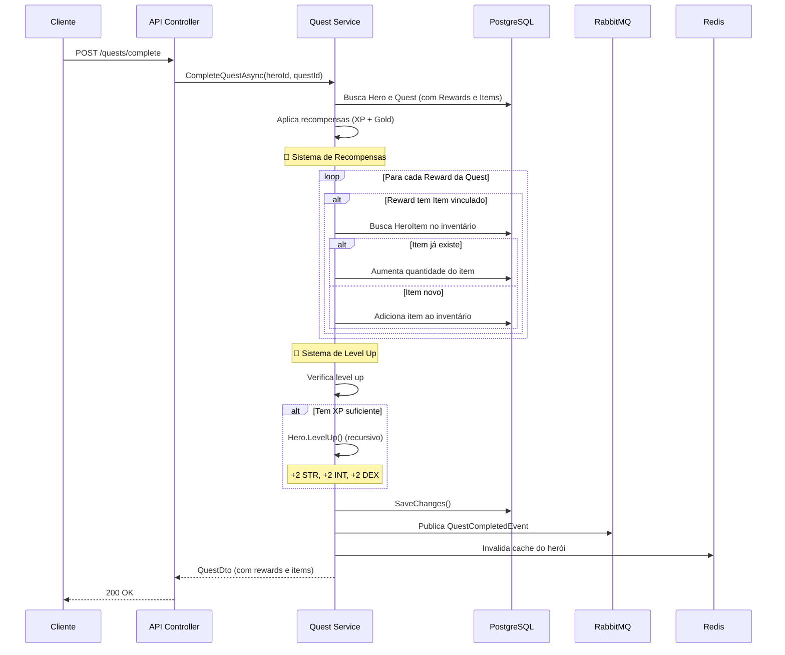

# 🐉 RPG Quest Manager - O Livro de Eldoria

<div align="center">

**API RESTful completa para gerenciamento de sistema RPG com heróis, quests, inimigos e recompensas**

[](https://dotnet.microsoft.com/)
[](https://docs.microsoft.com/en-us/dotnet/csharp/)
[](https://www.postgresql.org/)
[](https://redis.io/)
[](https://www.rabbitmq.com/)
[](https://www.docker.com/)

[]()
[](LICENSE)

[Características](#-características) •
[Instalação](#-instalação-rápida) •
[Documentação](#-documentação-da-api) •
[Arquitetura](#-arquitetura) •
[Testes](#-testes)

</div>

---

## 📋 Índice

- [Sobre o Projeto](#-sobre-o-projeto)
- [Características](#-características)
- [Stack Tecnológica](#-stack-tecnológica)
- [Instalação Rápida](#-instalação-rápida)
- [Documentação da API](#-documentação-da-api)
- [Arquitetura](#-arquitetura)
- [Testes](#-testes)
- [Variáveis de Ambiente](#-variáveis-de-ambiente)
- [Troubleshooting](#-troubleshooting)
- [Roadmap](#-roadmap)
- [Contribuindo](#-contribuindo)
- [Licença](#-licença)

---

## 🎯 Sobre o Projeto

O **RPG Quest Manager** é um sistema completo de gerenciamento de RPG com **API REST (.NET 8)** e **Frontend React 18**. O projeto demonstra a aplicação de conceitos avançados de arquitetura de software, boas práticas de desenvolvimento e tecnologias modernas.

### 🎮 Conceito

Inspirado em jogos de RPG clássicos, o sistema permite:
- 🦸 Criar e gerenciar heróis com diferentes classes e atributos
- 🎯 Definir quests (missões) com requisitos de nível e classe
- 👹 Cadastrar inimigos e recompensas vinculadas a itens reais
- 📈 Sistema automático de progressão de nível baseado em XP
- 🎒 Gerenciamento de inventário com itens equipáveis
- 🔔 Sistema de notificações em tempo real
- 📚 Catálogo de missões com sistema de aceitação
- 🎓 Tutorial interativo para novos jogadores

---

## 🚀 Quick Start (2 minutos!)

### Pré-requisitos

- **Docker Desktop** instalado e rodando

**Isso é TUDO que você precisa!** 🎉

### Iniciar o Sistema Completo

```bash
# Clone o repositório
git clone https://github.com/seu-usuario/rpg-quest-manager.git
cd rpg-quest-manager

# Inicie TODOS os serviços (API + Frontend + Banco + Redis + RabbitMQ)
docker-compose up -d --build
```

Aguarde ~1-2 minutos. Verifique o status com:
```bash
docker-compose ps
```

### 🌐 Acessos

| Serviço | URL | Descrição |
|---------|-----|-----------|
| **Frontend React** | http://localhost:3000 | ⭐ **COMECE AQUI!** Interface completa |
| **Swagger UI** | http://localhost:5000/swagger | Documentação interativa da API |
| **API REST** | http://localhost:5000/api/v1 | Backend .NET 8 |
| **RabbitMQ** | http://localhost:15672 | Management UI (guest/guest) |

### 👤 Usuários de Teste

O banco já vem populado! Use:

| Username | Password | Role | Herói Vinculado |
|----------|----------|------|-----------------|
| `admin` | `admin123` | **Admin** | - (controle total) |
| `player1` | `senha123` | **Player** | Aragorn (Guerreiro Nv.15) |
| `gamer` | `senha456` | **Player** | Gandalf (Mago Nv.20) |

**Ou registre um novo usuário** pela interface (será criado como Player).

### 🎮 Experiência do Jogador

1. Acesse http://localhost:3000
2. Faça login com `player1` / `senha123`
3. **Tutorial interativo** aparece automaticamente! 🎓
4. Explore:
   - 👤 **Meu Perfil**: Veja seu herói, inventário e missões
   - 📚 **Catálogo de Missões**: Aceite missões compatíveis
   - 🔔 **Notificações**: Avisos de level up e novas missões
   - 📊 **Dashboard**: Estatísticas gerais

### 🛠️ Comandos Úteis

```bash
# Parar tudo
docker-compose down

# Ver logs
docker-compose logs -f

# Rebuild completo
docker-compose down && docker-compose up -d --build
```

---

## ✨ Características

### 🎯 Funcionalidades Principais

#### Backend (.NET 8)
- ✅ **Sistema de Autenticação JWT com Roles** - Login, registro e controle de permissões (Admin/Player)
- ✅ **CRUD Completo de Heróis** - Gerenciamento de personagens com atributos customizáveis
- ✅ **CRUD Completo de Quests** - Criação de missões com requisitos de nível e classe
- ✅ **Sistema de Catálogo de Missões** - Endpoint dedicado com flags `isAccepted` e `canAccept`
- ✅ **Sistema de Aceitação de Missões** - Validação automática de requisitos
- ✅ **Sistema de Recompensas Inteligente** - Itens reais adicionados automaticamente ao inventário
- ✅ **Sistema de Inventário Completo** - Gerenciamento de itens com equipamento e bônus
- ✅ **Progressão Automática** - Level up automático com recompensas (XP, ouro, atributos)
- ✅ **Sistema de Notificações** - Avisos de level up e novas missões disponíveis
- ✅ **Cache Inteligente** - Redis para otimizar consultas frequentes (Top 10 heróis, Quests mais jogadas)
- ✅ **Eventos Assíncronos** - RabbitMQ para notificações de conclusão de quests
- ✅ **Validações Robustas** - FluentValidation em todas as entradas
- ✅ **Logs Estruturados** - Serilog para rastreabilidade completa
- ✅ **Documentação Swagger Completa** - API totalmente documentada com exemplos e descrições detalhadas

#### Frontend (React 18)
- ✅ **Interface Moderna e Responsiva** - Design "épico" com Tailwind CSS e animações
- ✅ **Sistema de Autenticação** - Login, registro e controle de sessão
- ✅ **Dashboard Interativo** - Estatísticas gerais com top heróis e missões
- ✅ **Perfil do Jogador** - Visualização completa do herói, inventário e missões completadas
- ✅ **Catálogo de Missões com Abas** - "Catálogo" (todas) e "Minhas Missões" (aceitas)
- ✅ **Sistema de Aceitação Visual** - Badges de status (Disponível, Aceita, Bloqueada)
- ✅ **Notificações em Tempo Real** - Sino com contador e painel dropdown
- ✅ **Tutorial Interativo** - Wizard de 7 passos para novos jogadores
- ✅ **Internacionalização (i18n)** - Suporte a múltiplos idiomas
- ✅ **Rotas Protegidas** - Controle de acesso baseado em roles
- ✅ **Panel Admin** - Interface completa para gerenciamento (apenas Admin)

### 🌟 Recursos Avançados

- 🔮 **Sistema de Progressão Automática por XP**
  - Fórmula: `XP Necessário = Nível × 100`
  - Level up automático com aumento de atributos (+2 Força, +2 Inteligência, +2 Destreza)
  - Recompensa de ouro ao subir de nível (Nível × 50 ouro)
  - **Notificações automáticas** ao jogador com detalhes das recompensas
  - Suporte a múltiplos níveis em uma única quest
  
- 🎒 **Sistema de Inventário Completo**
  - Adicionar/remover itens
  - Equipar/desequipar itens
  - Itens com bônus de atributos (Força, Inteligência, Destreza)
  - **Itens de recompensa adicionados automaticamente ao completar quests**
  - Stacking de itens duplicados
  
- 📚 **Sistema de Catálogo e Aceitação de Missões**
  - Missões com requisitos de **nível** e **classe** (Guerreiro, Mago, Arqueiro, Any)
  - Endpoint `/catalog` com flags `isAccepted` e `canAccept` para cada missão
  - Validação automática de requisitos ao aceitar
  - Feedback visual no frontend (badges de status)
  
- 🔔 **Sistema de Notificações em Tempo Real**
  - Notificações de level up com detalhes completos
  - Lista de novas missões disponíveis após subir de nível
  - Contador de não lidas no frontend
  - Marcar como lida individual ou em massa
  
- 🎓 **Tutorial Interativo para Novos Jogadores**
  - Wizard de 7 passos explicando o sistema
  - Salvo no backend (flag `HasSeenTutorial`)
  - Apenas aparece uma vez por usuário
  - Pode ser pulado a qualquer momento
  
- 🔐 **Sistema de Roles e Permissões Granular**
  - **Admin**: CRUD completo + completar missões para jogadores
  - **Player**: Visualizar perfil, aceitar missões, gerenciar inventário
  - Tokens JWT com 24h de validade
  - Hash seguro de senhas (SHA256)
  - Controle de acesso em nível de endpoint e frontend
  
- 🎁 **Sistema de Recompensas Inteligente**
  - Recompensas vinculadas a itens **reais** da tabela Items
  - Itens automaticamente adicionados ao inventário do herói
  - Suporte a quantidade de itens (stackable)
  - Ouro e XP creditados automaticamente
  
- 📨 **Eventos Assíncronos com RabbitMQ**
  - Publicação ao completar quests
  - Consumer para processamento de eventos
  - Logs estruturados de eventos
  
- 👤 **Perfil de Jogador Personalizado**
  - Heróis vinculados a usuários via `UserId`
  - Endpoint dedicado `/profile/my-hero`
  - Visualização de inventário e histórico de missões
  - Estatísticas pessoais

---

## 🛠️ Stack Tecnológica

### Backend & Framework
- **.NET 8** - Framework moderno e performático
- **C# 12** - Últimas features da linguagem
- **ASP.NET Core** - Web API RESTful

### Frontend & UI
- **React 18** - Biblioteca JavaScript moderna
- **TypeScript 5** - Type safety
- **Vite** - Build tool rápida
- **Tailwind CSS** - Utility-first CSS framework
- **React Router** - Navegação SPA
- **Axios** - Cliente HTTP
- **i18next** - Internacionalização

### Banco de Dados & Cache
- **PostgreSQL 15** - Banco relacional robusto
- **Entity Framework Core 8** - ORM com migrations
- **Redis 7** - Cache distribuído

### Mensageria
- **RabbitMQ 3** - Message broker
- **MassTransit 8** - Abstração para mensageria

### Segurança & Validação
- **JWT Bearer** - Autenticação baseada em tokens
- **FluentValidation** - Validação declarativa
- **SHA256** - Hash de senhas
- **CORS** - Políticas de segurança

### Ferramentas & Qualidade
- **AutoMapper** - Mapeamento de objetos (backend)
- **Serilog** - Logs estruturados
- **Swagger/OpenAPI** - Documentação interativa
- **xUnit** - Framework de testes (backend)
- **Moq** - Mocking para testes
- **FluentAssertions** - Assertions legíveis

### DevOps & Infraestrutura
- **Docker** - Containerização
- **Docker Compose** - Orquestração multi-container
- **Nginx** - Proxy reverso e servidor web (frontend)
- **Health Checks** - Monitoramento de serviços

---

## 📦 Estrutura de Containers

Quando você executa `docker-compose up -d`, os seguintes containers são criados:

| Container | Porta | Descrição |
|-----------|-------|-----------|
| `rpg-postgres` | 5432 | PostgreSQL 15 (banco de dados) |
| `rpg-redis` | 6379 | Redis 7 (cache) |
| `rpg-rabbitmq` | 5672, 15672 | RabbitMQ 3 (mensageria) |
| `rpg-api` | 5000, 5001 | API .NET 8 (backend) |
| `rpg-frontend` | 3000 (80 interno) | React 18 + Nginx (frontend) |

Todos os containers estão na mesma rede Docker (`rpg-network`) e se comunicam entre si.  
O frontend utiliza **Nginx** como proxy reverso para comunicar com a API.

### 🗄️ Dados Iniciais (Seeder)

O banco de dados é automaticamente populado com dados de exemplo:
- 👤 **3 usuários**: `admin` (Admin), `player1` e `gamer` (Players com heróis)
- ⚔️ **12 heróis** de diferentes classes e níveis (1-20)
- 👹 **15 inimigos** variados (Goblins, Orcs, Dragões, Balrog, etc)
- 🎯 **13 quests** de todas as dificuldades e tipos (Main, Side, Daily)
- 🗡️ **15 itens** equipáveis (Espadas, Armaduras, Poções, etc)
- 💰 **Recompensas vinculadas** a itens reais

---

## 🔐 Sistema de Permissões

O sistema possui dois tipos de usuários com permissões diferentes:

### 👤 Player (Usuário Comum)

**PODE:**
- ✅ Visualizar heróis, quests, inimigos, itens, recompensas
- ✅ Completar quests e ganhar recompensas
- ✅ Gerenciar inventário (adicionar/equipar itens nos heróis)

**NÃO PODE:**
- ❌ Criar, editar ou deletar heróis
- ❌ Criar, editar ou deletar quests
- ❌ Criar, editar ou deletar inimigos
- ❌ Criar ou deletar itens
- ❌ Criar ou deletar recompensas

### 🛡️ Admin (Administrador)

**PODE TUDO:**
- 🔐 CRUD completo de heróis, quests, inimigos, itens e recompensas
- 🔐 Todas as funcionalidades de Player

### 📊 Matriz de Permissões

| Recurso | Player | Admin |
|---------|--------|-------|
| **Heróis** | 👁️ Ver | ✅ CRUD Completo |
| **Quests** | 👁️ Ver + ✅ Completar | ✅ CRUD Completo |
| **Inimigos** | 👁️ Ver | ✅ CRUD Completo |
| **Itens** | 👁️ Ver | ✅ Criar/Deletar |
| **Recompensas** | 👁️ Ver | ✅ Criar/Deletar |
| **Inventário** | ✅ Gerenciar | ✅ Gerenciar |

---

## 📚 Documentação da API

### Swagger UI

A documentação completa e interativa está disponível em:
```
http://localhost:5000
```

### Autenticação

Todos os endpoints (exceto `/auth/register` e `/auth/login`) requerem autenticação JWT.

#### 🔑 Usuários Pré-cadastrados (Seeder)

| Username | Password | Role | Descrição |
|----------|----------|------|-----------|
| `admin` | `admin123` | **Admin** | Acesso total ao sistema |
| `player1` | `senha123` | **Player** | Jogador comum |
| `gamer` | `senha123` | **Player** | Jogador comum |

#### 1. Login (Usuário Existente)

```http
POST /api/v1/auth/login
Content-Type: application/json

{
  "username": "admin",
  "password": "admin123"
}
```

**Resposta:**
```json
{
  "token": "eyJhbGciOiJIUzI1NiIsInR5cCI6IkpXVCJ9...",
  "username": "admin",
  "expiresAt": "2025-10-03T10:30:00Z"
}
```

#### 2. Registrar um Novo Usuário

```http
POST /api/v1/auth/register
Content-Type: application/json

{
  "username": "aragorn",
  "email": "aragorn@eldoria.com",
  "password": "senha123"
}
```

> ⚠️ **Nota**: Novos usuários são criados automaticamente como **Player** (sem permissões de Admin).

**Resposta:**
```json
{
  "token": "eyJhbGciOiJIUzI1NiIsInR5cCI6IkpXVCJ9...",
  "username": "aragorn",
  "expiresAt": "2025-10-03T12:00:00Z"
}
```

#### 3. Usar o Token

Adicione o token no header de todas as requisições:
```http
Authorization: Bearer seu_token_aqui
```

Ou use o botão **"Authorize"** no Swagger UI.

---

### Endpoints Principais

#### 🗡️ Heróis

| Método | Endpoint | Descrição | Permissão |
|--------|----------|-----------|-----------|
| `GET` | `/api/v1/heroes` | Lista todos os heróis | Player |
| `GET` | `/api/v1/heroes/{id}` | Busca herói por ID | Player |
| `GET` | `/api/v1/heroes/strongest` | Top heróis (CACHED) | Player |
| `POST` | `/api/v1/heroes` | Cria novo herói | 🔐 **Admin** |
| `PUT` | `/api/v1/heroes/{id}` | Atualiza herói | 🔐 **Admin** |
| `DELETE` | `/api/v1/heroes/{id}` | Remove herói | 🔐 **Admin** |
| `GET` | `/api/v1/heroes/{id}/inventory` | Lista inventário | Player |
| `POST` | `/api/v1/heroes/{id}/inventory/{itemId}` | Adiciona item | Player |
| `PUT` | `/api/v1/heroes/{id}/inventory/{heroItemId}/equip` | Equipa/desequipa item | Player |

#### 📜 Quests

| Método | Endpoint | Descrição | Permissão |
|--------|----------|-----------|-----------|
| `GET` | `/api/v1/quests` | Lista todas as quests (com recompensas e itens) | Player |
| `GET` | `/api/v1/quests/{id}` | Busca quest por ID | Player |
| `GET` | `/api/v1/quests/most-played` | Top quests (CACHED) | Player |
| `POST` | `/api/v1/quests` | Cria nova quest | 🔐 **Admin** |
| `PUT` | `/api/v1/quests/{id}` | Atualiza quest | 🔐 **Admin** |
| `DELETE` | `/api/v1/quests/{id}` | Remove quest | 🔐 **Admin** |
| `POST` | `/api/v1/quests/complete` | **🔥 Completa quest (XP + Ouro + Item!)** | Player |

#### 👹 Inimigos

| Método | Endpoint | Descrição | Permissão |
|--------|----------|-----------|-----------|
| `GET` | `/api/v1/enemies` | Lista todos os inimigos | Player |
| `GET` | `/api/v1/enemies/{id}` | Busca inimigo por ID | Player |
| `POST` | `/api/v1/enemies` | Cria novo inimigo | 🔐 **Admin** |
| `PUT` | `/api/v1/enemies/{id}` | Atualiza inimigo | 🔐 **Admin** |
| `DELETE` | `/api/v1/enemies/{id}` | Remove inimigo | 🔐 **Admin** |

#### 🗡️ Itens

| Método | Endpoint | Descrição | Permissão |
|--------|----------|-----------|-----------|
| `GET` | `/api/v1/items` | Lista todos os itens | Player |
| `GET` | `/api/v1/items/{id}` | Busca item por ID | Player |
| `POST` | `/api/v1/items` | Cria novo item | 🔐 **Admin** |
| `DELETE` | `/api/v1/items/{id}` | Remove item | 🔐 **Admin** |

#### 💰 Recompensas

| Método | Endpoint | Descrição | Permissão |
|--------|----------|-----------|-----------|
| `GET` | `/api/v1/rewards` | Lista todas as recompensas (com itens) | Player |
| `GET` | `/api/v1/rewards/{id}` | Busca recompensa por ID | Player |
| `GET` | `/api/v1/rewards/quest/{questId}` | Recompensas de uma quest | Player |
| `POST` | `/api/v1/rewards` | Cria nova recompensa | 🔐 **Admin** |
| `DELETE` | `/api/v1/rewards/{id}` | Remove recompensa | 🔐 **Admin** |

---

### Exemplo de Uso Completo

```bash
# 1. Login como Admin
curl -X POST http://localhost:5000/api/v1/auth/login \
  -H "Content-Type: application/json" \
  -d '{"username":"admin","password":"admin123"}'

# Resposta: { "token": "eyJhbGc...", "username": "admin", ... }

# 2. Buscar Quests Disponíveis (com recompensas)
curl -X GET http://localhost:5000/api/v1/quests \
  -H "Authorization: Bearer SEU_TOKEN_ADMIN"

# Resposta:
# [
#   {
#     "id": 1,
#     "name": "Caça aos Goblins",
#     "rewards": [{
#       "gold": 100,
#       "experience": 50,
#       "item": {
#         "name": "Espada de Ferro",
#         "bonusStrength": 5
#       }
#     }]
#   }
# ]

# 3. Completar Quest (Herói ganha XP, Ouro E o Item automaticamente!)
curl -X POST http://localhost:5000/api/v1/quests/complete \
  -H "Authorization: Bearer SEU_TOKEN_ADMIN" \
  -H "Content-Type: application/json" \
  -d '{"heroId":12,"questId":1}'

# ✅ Resultado:
# - Herói ganhou 50 XP (pode subir de nível!)
# - Herói ganhou 100 de ouro
# - Espada de Ferro foi adicionada automaticamente ao inventário!

# 4. Verificar Inventário do Herói
curl -X GET http://localhost:5000/api/v1/heroes/12 \
  -H "Authorization: Bearer SEU_TOKEN_ADMIN"

# Resposta mostra o herói com novo nível, XP, ouro e item no inventário!
```

---

## 🏗️ Arquitetura

### Estrutura do Projeto

```
rpg-quest-manager/
├── src/
│   └── RpgQuestManager.Api/
│       ├── Controllers/          # Endpoints da API (6 controllers)
│       ├── Models/               # Entidades do domínio (9 models)
│       ├── Data/                 # DbContext + Migrations
│       ├── Services/             # Lógica de negócio
│       │   ├── AuthService       # Autenticação JWT
│       │   ├── QuestService      # Lógica de quests
│       │   └── CacheService      # Integração Redis
│       ├── DTOs/                 # Data Transfer Objects (17 DTOs)
│       ├── Validators/           # FluentValidation (4 validators)
│       ├── Middleware/           # Tratamento de erros
│       ├── Events/               # Eventos RabbitMQ
│       └── Consumers/            # Consumidores de eventos
├── tests/
│   └── RpgQuestManager.Tests/   # Testes unitários (19 testes)
├── docker-compose.yml            # Orquestração
├── Dockerfile                    # Imagem da API
└── README.md                     # Este arquivo
```

### Diagrama de Arquitetura

```
┌─────────────────────────────────────────────────────────────┐
│                         Cliente                              │
│                     (Swagger / Postman)                      │
└────────────────────────┬────────────────────────────────────┘
                         │ HTTP/HTTPS
                         ▼
┌─────────────────────────────────────────────────────────────┐
│                    API (.NET 8)                              │
│  ┌─────────────┐  ┌──────────────┐  ┌──────────────┐       │
│  │ Controllers │→ │   Services   │→ │  Repository  │       │
│  └─────────────┘  └──────────────┘  └──────────────┘       │
│         │                 │                  │               │
│         ▼                 ▼                  ▼               │
│  ┌─────────────┐  ┌──────────────┐  ┌──────────────┐       │
│  │  Middleware │  │ FluentValid. │  │   AutoMapper │       │
│  └─────────────┘  └──────────────┘  └──────────────┘       │
└──────┬──────────────────────┬──────────────────────┬────────┘
       │                      │                      │
       ▼                      ▼                      ▼
┌─────────────┐       ┌─────────────┐       ┌─────────────┐
│ PostgreSQL  │       │    Redis    │       │  RabbitMQ   │
│  (Banco)    │       │   (Cache)   │       │  (Events)   │
└─────────────┘       └─────────────┘       └─────────────┘
```

### Fluxo de Conclusão de Quest



### Tecnologias por Camada

| Camada | Tecnologias |
|--------|-------------|
| **Apresentação** | ASP.NET Core Controllers, Swagger |
| **Aplicação** | Services, DTOs, AutoMapper |
| **Domínio** | Models, Business Logic |
| **Infraestrutura** | EF Core, Redis, RabbitMQ |
| **Cross-Cutting** | Serilog, FluentValidation, JWT |

---

## 🧪 Testes

### Executar Testes

```bash
# Executar todos os testes
dotnet test

# Executar com detalhes
dotnet test --logger "console;verbosity=detailed"

# Executar com cobertura
dotnet test /p:CollectCoverage=true
```

### Cobertura de Testes

O projeto possui **19 testes unitários** cobrindo:

#### 📊 HeroTests (6 testes)
- ✅ Herói inicia no nível 1
- ✅ Cálculo de XP para próximo nível
- ✅ Level up com XP suficiente
- ✅ Level up múltiplo
- ✅ Prevenção de level up sem XP
- ✅ Aumento de atributos ao subir nível

#### 📊 QuestServiceTests (7 testes)
- ✅ Aplicação de recompensas
- ✅ Level up ao completar quest
- ✅ Validação de herói não encontrado
- ✅ Validação de quest não encontrada
- ✅ Validação de quest já completada
- ✅ Publicação de evento RabbitMQ
- ✅ Invalidação de cache

#### 📊 ValidatorTests (6 testes)
- ✅ Validação de registro válido
- ✅ Username muito curto
- ✅ Email inválido
- ✅ Classe de herói inválida
- ✅ Atributos fora do range
- ✅ Dificuldade de quest inválida

### Métricas

```
✅ 19 testes passando
⚡ Tempo médio: < 1 segundo
📊 Cobertura: ~80% das regras de negócio
```

---

## ⚙️ Variáveis de Ambiente

### Arquivo: `appsettings.json`

```json
{
  "ConnectionStrings": {
    "DefaultConnection": "Host=postgres;Port=5432;Database=rpgquestmanager;...",
    "Redis": "redis:6379"
  },
  "Jwt": {
    "Key": "SUA_CHAVE_SECRETA_AQUI",
    "Issuer": "RpgQuestManager",
    "Audience": "RpgQuestManager"
  },
  "RabbitMQ": {
    "Host": "rabbitmq",
    "Username": "guest",
    "Password": "guest"
  }
}
```

### Configuração via Docker Compose

As variáveis são injetadas automaticamente pelo `docker-compose.yml`:

```yaml
environment:
  - ConnectionStrings__DefaultConnection=Host=postgres;...
  - ConnectionStrings__Redis=redis:6379
  - RabbitMQ__Host=rabbitmq
```

---

## 🔧 Troubleshooting

### Problemas Comuns

#### ❌ Docker não inicia

**Erro**: `Cannot connect to the Docker daemon`

**Solução**:
1. Certifique-se que o Docker Desktop está rodando
2. Reinicie o Docker Desktop
3. No Windows, verifique se o WSL2 está ativo

#### ❌ Porta já em uso

**Erro**: `Bind for 0.0.0.0:5000 failed: port is already allocated`

**Solução**:
```bash
# Parar todos os containers
docker-compose down

# Verificar portas em uso
netstat -ano | findstr :5000  # Windows
lsof -i :5000                 # Linux/Mac

# Mudar a porta no docker-compose.yml
ports:
  - "5001:80"  # Ao invés de 5000:80
```

#### ❌ Migrations não aplicadas

**Erro**: `Cannot create database`

**Solução**:
```bash
# Recriar o banco
docker-compose down -v
docker-compose up --build
```

#### ❌ RabbitMQ não conecta

**Erro**: `Unable to connect to RabbitMQ`

**Solução**:
Aguarde mais tempo. O RabbitMQ leva ~30 segundos para inicializar completamente.

---

## 🗺️ Roadmap

### Próximas Funcionalidades

- [ ] 🎮 Sistema de combate em tempo real
- [ ] 🏆 Sistema de conquistas e badges
- [ ] 👥 Sistema de guildas/clãs
- [ ] 💬 Chat em tempo real (SignalR)
- [ ] 📊 Dashboard com estatísticas
- [ ] 🌍 Sistema de regiões e mapas
- [ ] ⚔️ PvP (Player vs Player)
- [ ] 🎲 Sistema de crafting de itens
- [ ] 📱 App Mobile (React Native)
- [ ] 🔄 GraphQL API

### Melhorias Técnicas

- [ ] 🔐 Refresh tokens
- [ ] 📦 CQRS pattern
- [ ] 🎯 Event Sourcing
- [ ] 🧪 Testes de integração
- [ ] 📈 Monitoramento (Prometheus + Grafana)
- [ ] 🚀 CI/CD (GitHub Actions)
- [ ] ☁️ Deploy em Cloud (Azure/AWS)

---

## 🤝 Contribuindo

Contribuições são bem-vindas! Siga estes passos:

### 1. Fork o Projeto

```bash
git clone https://github.com/seu-usuario/rpg-quest-manager.git
cd rpg-quest-manager
```

### 2. Crie uma Branch

```bash
git checkout -b feature/MinhaNovaFeature
```

### 3. Commit suas Mudanças

```bash
git commit -m "feat: adiciona MinhaNovaFeature"
```

Siga o padrão de commits:
- `feat:` - Nova funcionalidade
- `fix:` - Correção de bug
- `docs:` - Documentação
- `test:` - Testes
- `refactor:` - Refatoração

### 4. Push para o GitHub

```bash
git push origin feature/MinhaNovaFeature
```

### 5. Abra um Pull Request

Descreva suas mudanças detalhadamente!

---

## 📄 Licença

Este projeto está sob a licença MIT. Veja o arquivo [LICENSE](LICENSE) para mais detalhes.

---

## 🙏 Agradecimentos

- **Conselho dos Anciãos de Eldoria** - Por propor o desafio épico
- **.NET Foundation** - Pela excelente plataforma
- **Comunidade Open Source** - Pelas ferramentas incríveis

---

## 📞 Contato

**Eldoria Dev Team**

- 📧 Email: dev@eldoria.com
- 🌐 Website: https://eldoria.dev
- 💬 Discord: [Servidor Eldoria](https://discord.gg/eldoria)

---

<div align="center">

### 🐉 **"Heróis não nascem prontos. Eles são forjados na batalha."** ⚔️

**Desenvolvido com ❤️ e muito ☕ por aventureiros do código**

[](https://github.com/seu-usuario/rpg-quest-manager/stargazers)
[](https://github.com/seu-usuario/rpg-quest-manager/network/members)

</div>
