# 🐉 RPG Quest Manager - O Livro de Eldoria

<div align="center">

**API RESTful completa para gerenciamento de sistema RPG com heróis, quests, inimigos e recompensas**

[](https://dotnet.microsoft.com/)
[](https://docs.microsoft.com/en-us/dotnet/csharp/)
[](https://www.postgresql.org/)
[](https://redis.io/)
[](https://www.rabbitmq.com/)
[](https://www.docker.com/)

[]()
[](LICENSE)

[Características](#-características) •
[Instalação](#-instalação-rápida) •
[Documentação](#-documentação-da-api) •
[Arquitetura](#-arquitetura) •
[Testes](#-testes)

</div>

---

## 📋 Índice

- [Sobre o Projeto](#-sobre-o-projeto)
- [Características](#-características)
- [Stack Tecnológica](#-stack-tecnológica)
- [Instalação Rápida](#-instalação-rápida)
- [Documentação da API](#-documentação-da-api)
- [Arquitetura](#-arquitetura)
- [Testes](#-testes)
- [Variáveis de Ambiente](#-variáveis-de-ambiente)
- [Troubleshooting](#-troubleshooting)
- [Roadmap](#-roadmap)
- [Contribuindo](#-contribuindo)
- [Licença](#-licença)

---

## 🎯 Sobre o Projeto

O **RPG Quest Manager** é uma API RESTful completa desenvolvida em .NET 8 que implementa um sistema de gerenciamento de RPG. O projeto demonstra a aplicação de conceitos avançados de arquitetura de software, boas práticas de desenvolvimento e tecnologias modernas.

### 🎮 Conceito

Inspirado em jogos de RPG clássicos, a API permite:
- Criar e gerenciar heróis com diferentes classes e atributos
- Definir quests (missões) com níveis de dificuldade variados
- Cadastrar inimigos e recompensas
- Sistema automático de progressão de nível baseado em XP
- Gerenciamento de inventário com itens equipáveis
- Eventos assíncronos para notificações em tempo real

---

## ✨ Características

### 🎯 Funcionalidades Principais

- ✅ **Sistema de Autenticação JWT** - Registro, login e proteção de rotas
- ✅ **CRUD Completo de Heróis** - Gerenciamento de personagens com atributos customizáveis
- ✅ **CRUD Completo de Quests** - Criação de missões com recompensas
- ✅ **CRUD Completo de Inimigos** - Cadastro de adversários com características únicas
- ✅ **CRUD Completo de Recompensas** - Sistema de premiação (ouro, XP, itens)
- ✅ **Sistema de Inventário** - Gerenciamento de itens com equipamento
- ✅ **Progressão Automática** - Level up automático ao ganhar XP suficiente
- ✅ **Cache Inteligente** - Redis para otimizar consultas frequentes
- ✅ **Eventos Assíncronos** - RabbitMQ para notificações de conclusão de quests
- ✅ **Validações Robustas** - FluentValidation em todas as entradas
- ✅ **Logs Estruturados** - Serilog para rastreabilidade completa
- ✅ **Documentação Swagger** - API totalmente documentada com exemplos

### 🌟 Missões Secretas (Recursos Avançados)

- 🔮 **Sistema de Progressão Automática por XP**
  - Fórmula: `XP Necessário = Nível × 100`
  - Level up automático com aumento de atributos
  - Suporte a múltiplos níveis em uma única quest
  
- 🎒 **Sistema de Inventário Completo**
  - Adicionar/remover itens
  - Equipar/desequipar itens
  - Itens com bônus de atributos
  
- 🔐 **Autenticação JWT Completa**
  - Tokens com 24h de validade
  - Proteção de rotas sensíveis
  - Hash seguro de senhas (SHA256)
  
- 📨 **Eventos Assíncronos**
  - Publicação no RabbitMQ ao completar quests
  - Consumer para processamento de eventos
  - Logs estruturados de eventos

---

## 🛠️ Stack Tecnológica

### Backend & Framework
- **.NET 8** - Framework moderno e performático
- **C# 12** - Últimas features da linguagem
- **ASP.NET Core** - Web API

### Banco de Dados & Cache
- **PostgreSQL 15** - Banco relacional robusto
- **Entity Framework Core 8** - ORM com migrations
- **Redis 7** - Cache distribuído

### Mensageria
- **RabbitMQ 3** - Message broker
- **MassTransit 8** - Abstração para mensageria

### Segurança & Validação
- **JWT Bearer** - Autenticação baseada em tokens
- **FluentValidation** - Validação declarativa
- **SHA256** - Hash de senhas

### Ferramentas & Qualidade
- **AutoMapper** - Mapeamento de objetos
- **Serilog** - Logs estruturados
- **Swagger/OpenAPI** - Documentação interativa
- **xUnit** - Framework de testes
- **Moq** - Mocking para testes
- **FluentAssertions** - Assertions legíveis

### DevOps & Infraestrutura
- **Docker** - Containerização
- **Docker Compose** - Orquestração multi-container
- **Health Checks** - Monitoramento de serviços

---

## 🚀 Instalação Rápida

### Pré-requisitos

Certifique-se de ter instalado:
- [Docker Desktop](https://www.docker.com/products/docker-desktop) (Windows, Mac ou Linux)
- [Git](https://git-scm.com/downloads) (para clonar o repositório)

> 💡 **Nota**: Não é necessário instalar .NET, PostgreSQL, Redis ou RabbitMQ localmente. Tudo roda via Docker!

### Passo a Passo

1. **Clone o repositório**
   ```bash
   git clone https://github.com/seu-usuario/rpg-quest-manager.git
   cd rpg-quest-manager
   ```

2. **Inicie o Docker Desktop**
   - Aguarde até o Docker estar completamente iniciado (ícone verde)

3. **Suba os containers**
   ```bash
   docker-compose up --build
   ```

4. **Aguarde a inicialização** (pode levar 1-2 minutos na primeira vez)
   
   Você verá mensagens como:
   ```
   rpg-postgres  | database system is ready to accept connections
   rpg-redis     | Ready to accept connections
   rpg-rabbitmq  | Server startup complete
   rpg-api       | 🐉 RPG Quest Manager API iniciada!
   ```

5. **Acesse a API**
   ```
   http://localhost:5000
   ```

### ✅ Verificação

Se tudo estiver funcionando, você verá:
- 🌐 **Swagger UI** em http://localhost:5000
- 🐰 **RabbitMQ Management** em http://localhost:15672 (guest/guest)
- ✅ **Health Check** em http://localhost:5000/health

---

## 📚 Documentação da API

### Swagger UI

A documentação completa e interativa está disponível em:
```
http://localhost:5000
```

### Autenticação

Todos os endpoints (exceto `/auth/register` e `/auth/login`) requerem autenticação JWT.

#### 1. Registrar um Usuário

```http
POST /api/v1/auth/register
Content-Type: application/json

{
  "username": "aragorn",
  "email": "aragorn@eldoria.com",
  "password": "senha123"
}
```

**Resposta:**
```json
{
  "token": "eyJhbGciOiJIUzI1NiIsInR5cCI6IkpXVCJ9...",
  "username": "aragorn",
  "expiresAt": "2025-10-03T12:00:00Z"
}
```

#### 2. Fazer Login

```http
POST /api/v1/auth/login
Content-Type: application/json

{
  "username": "aragorn",
  "password": "senha123"
}
```

#### 3. Usar o Token

Adicione o token no header de todas as requisições:
```http
Authorization: Bearer seu_token_aqui
```

Ou use o botão **"Authorize"** no Swagger UI.

---

### Endpoints Principais

#### 🗡️ Heróis

| Método | Endpoint | Descrição |
|--------|----------|-----------|
| `GET` | `/api/v1/heroes` | Lista todos os heróis |
| `GET` | `/api/v1/heroes/{id}` | Busca herói por ID |
| `GET` | `/api/v1/heroes/strongest` | Top heróis (CACHED) |
| `POST` | `/api/v1/heroes` | Cria novo herói |
| `PUT` | `/api/v1/heroes/{id}` | Atualiza herói |
| `DELETE` | `/api/v1/heroes/{id}` | Remove herói |
| `GET` | `/api/v1/heroes/{id}/inventory` | Lista inventário |
| `POST` | `/api/v1/heroes/{id}/inventory/{itemId}` | Adiciona item |
| `PUT` | `/api/v1/heroes/{id}/inventory/{heroItemId}/equip` | Equipa/desequipa item |

#### 📜 Quests

| Método | Endpoint | Descrição |
|--------|----------|-----------|
| `GET` | `/api/v1/quests` | Lista todas as quests |
| `GET` | `/api/v1/quests/{id}` | Busca quest por ID |
| `GET` | `/api/v1/quests/most-played` | Top quests (CACHED) |
| `POST` | `/api/v1/quests` | Cria nova quest |
| `PUT` | `/api/v1/quests/{id}` | Atualiza quest |
| `DELETE` | `/api/v1/quests/{id}` | Remove quest |
| `POST` | `/api/v1/quests/complete` | **Completa quest (Level Up!)** |

#### 👹 Inimigos

| Método | Endpoint | Descrição |
|--------|----------|-----------|
| `GET` | `/api/v1/enemies` | Lista todos os inimigos |
| `POST` | `/api/v1/enemies` | Cria novo inimigo |
| `PUT` | `/api/v1/enemies/{id}` | Atualiza inimigo |
| `DELETE` | `/api/v1/enemies/{id}` | Remove inimigo |

#### 💰 Recompensas & Itens

Similar aos endpoints acima. Veja a documentação completa no Swagger.

---

### Exemplo de Uso Completo

```bash
# 1. Registrar
curl -X POST http://localhost:5000/api/v1/auth/register \
  -H "Content-Type: application/json" \
  -d '{"username":"gandalf","email":"gandalf@eldoria.com","password":"youshallnotpass"}'

# 2. Criar Herói (use o token recebido)
curl -X POST http://localhost:5000/api/v1/heroes \
  -H "Authorization: Bearer SEU_TOKEN" \
  -H "Content-Type: application/json" \
  -d '{"name":"Gandalf","class":"Mago","strength":8,"intelligence":20,"dexterity":12}'

# 3. Criar Quest
curl -X POST http://localhost:5000/api/v1/quests \
  -H "Authorization: Bearer SEU_TOKEN" \
  -H "Content-Type: application/json" \
  -d '{"name":"Derrotar Balrog","description":"Enfrentar o demônio das profundezas","difficulty":"Épico","experienceReward":500,"goldReward":1000}'

# 4. Completar Quest (Herói ganha XP e pode subir de nível!)
curl -X POST http://localhost:5000/api/v1/quests/complete \
  -H "Authorization: Bearer SEU_TOKEN" \
  -H "Content-Type: application/json" \
  -d '{"heroId":1,"questId":1}'
```

---

## 🏗️ Arquitetura

### Estrutura do Projeto

```
rpg-quest-manager/
├── src/
│   └── RpgQuestManager.Api/
│       ├── Controllers/          # Endpoints da API (6 controllers)
│       ├── Models/               # Entidades do domínio (9 models)
│       ├── Data/                 # DbContext + Migrations
│       ├── Services/             # Lógica de negócio
│       │   ├── AuthService       # Autenticação JWT
│       │   ├── QuestService      # Lógica de quests
│       │   └── CacheService      # Integração Redis
│       ├── DTOs/                 # Data Transfer Objects (17 DTOs)
│       ├── Validators/           # FluentValidation (4 validators)
│       ├── Middleware/           # Tratamento de erros
│       ├── Events/               # Eventos RabbitMQ
│       └── Consumers/            # Consumidores de eventos
├── tests/
│   └── RpgQuestManager.Tests/   # Testes unitários (19 testes)
├── docker-compose.yml            # Orquestração
├── Dockerfile                    # Imagem da API
└── README.md                     # Este arquivo
```

### Diagrama de Arquitetura

```
┌─────────────────────────────────────────────────────────────┐
│                         Cliente                              │
│                     (Swagger / Postman)                      │
└────────────────────────┬────────────────────────────────────┘
                         │ HTTP/HTTPS
                         ▼
┌─────────────────────────────────────────────────────────────┐
│                    API (.NET 8)                              │
│  ┌─────────────┐  ┌──────────────┐  ┌──────────────┐       │
│  │ Controllers │→ │   Services   │→ │  Repository  │       │
│  └─────────────┘  └──────────────┘  └──────────────┘       │
│         │                 │                  │               │
│         ▼                 ▼                  ▼               │
│  ┌─────────────┐  ┌──────────────┐  ┌──────────────┐       │
│  │  Middleware │  │ FluentValid. │  │   AutoMapper │       │
│  └─────────────┘  └──────────────┘  └──────────────┘       │
└──────┬──────────────────────┬──────────────────────┬────────┘
       │                      │                      │
       ▼                      ▼                      ▼
┌─────────────┐       ┌─────────────┐       ┌─────────────┐
│ PostgreSQL  │       │    Redis    │       │  RabbitMQ   │
│  (Banco)    │       │   (Cache)   │       │  (Events)   │
└─────────────┘       └─────────────┘       └─────────────┘
```

### Fluxo de Conclusão de Quest

```mermaid
sequenceDiagram
    participant C as Cliente
    participant API as API Controller
    participant S as Quest Service
    participant DB as PostgreSQL
    participant R as RabbitMQ
    participant Cache as Redis

    C->>API: POST /quests/complete
    API->>S: CompleteQuestAsync(heroId, questId)
    S->>DB: Busca Hero e Quest
    S->>S: Aplica recompensas (XP + Gold)
    S->>S: Verifica level up
    alt Tem XP suficiente
        S->>S: Hero.LevelUp() (recursivo)
    end
    S->>DB: SaveChanges()
    S->>R: Publica QuestCompletedEvent
    S->>Cache: Invalida cache do herói
    S-->>API: QuestDto
    API-->>C: 200 OK
```



### Tecnologias por Camada

| Camada | Tecnologias |
|--------|-------------|
| **Apresentação** | ASP.NET Core Controllers, Swagger |
| **Aplicação** | Services, DTOs, AutoMapper |
| **Domínio** | Models, Business Logic |
| **Infraestrutura** | EF Core, Redis, RabbitMQ |
| **Cross-Cutting** | Serilog, FluentValidation, JWT |

---

## 🧪 Testes

### Executar Testes

```bash
# Executar todos os testes
dotnet test

# Executar com detalhes
dotnet test --logger "console;verbosity=detailed"

# Executar com cobertura
dotnet test /p:CollectCoverage=true
```

### Cobertura de Testes

O projeto possui **19 testes unitários** cobrindo:

#### 📊 HeroTests (6 testes)
- ✅ Herói inicia no nível 1
- ✅ Cálculo de XP para próximo nível
- ✅ Level up com XP suficiente
- ✅ Level up múltiplo
- ✅ Prevenção de level up sem XP
- ✅ Aumento de atributos ao subir nível

#### 📊 QuestServiceTests (7 testes)
- ✅ Aplicação de recompensas
- ✅ Level up ao completar quest
- ✅ Validação de herói não encontrado
- ✅ Validação de quest não encontrada
- ✅ Validação de quest já completada
- ✅ Publicação de evento RabbitMQ
- ✅ Invalidação de cache

#### 📊 ValidatorTests (6 testes)
- ✅ Validação de registro válido
- ✅ Username muito curto
- ✅ Email inválido
- ✅ Classe de herói inválida
- ✅ Atributos fora do range
- ✅ Dificuldade de quest inválida

### Métricas

```
✅ 19 testes passando
⚡ Tempo médio: < 1 segundo
📊 Cobertura: ~80% das regras de negócio
```

---

## ⚙️ Variáveis de Ambiente

### Arquivo: `appsettings.json`

```json
{
  "ConnectionStrings": {
    "DefaultConnection": "Host=postgres;Port=5432;Database=rpgquestmanager;...",
    "Redis": "redis:6379"
  },
  "Jwt": {
    "Key": "SUA_CHAVE_SECRETA_AQUI",
    "Issuer": "RpgQuestManager",
    "Audience": "RpgQuestManager"
  },
  "RabbitMQ": {
    "Host": "rabbitmq",
    "Username": "guest",
    "Password": "guest"
  }
}
```

### Configuração via Docker Compose

As variáveis são injetadas automaticamente pelo `docker-compose.yml`:

```yaml
environment:
  - ConnectionStrings__DefaultConnection=Host=postgres;...
  - ConnectionStrings__Redis=redis:6379
  - RabbitMQ__Host=rabbitmq
```

---

## 🔧 Troubleshooting

### Problemas Comuns

#### ❌ Docker não inicia

**Erro**: `Cannot connect to the Docker daemon`

**Solução**:
1. Certifique-se que o Docker Desktop está rodando
2. Reinicie o Docker Desktop
3. No Windows, verifique se o WSL2 está ativo

#### ❌ Porta já em uso

**Erro**: `Bind for 0.0.0.0:5000 failed: port is already allocated`

**Solução**:
```bash
# Parar todos os containers
docker-compose down

# Verificar portas em uso
netstat -ano | findstr :5000  # Windows
lsof -i :5000                 # Linux/Mac

# Mudar a porta no docker-compose.yml
ports:
  - "5001:80"  # Ao invés de 5000:80
```

#### ❌ Migrations não aplicadas

**Erro**: `Cannot create database`

**Solução**:
```bash
# Recriar o banco
docker-compose down -v
docker-compose up --build
```

#### ❌ RabbitMQ não conecta

**Erro**: `Unable to connect to RabbitMQ`

**Solução**:
Aguarde mais tempo. O RabbitMQ leva ~30 segundos para inicializar completamente.

---

## 🗺️ Roadmap

### Próximas Funcionalidades

- [ ] 🎮 Sistema de combate em tempo real
- [ ] 🏆 Sistema de conquistas e badges
- [ ] 👥 Sistema de guildas/clãs
- [ ] 💬 Chat em tempo real (SignalR)
- [ ] 📊 Dashboard com estatísticas
- [ ] 🌍 Sistema de regiões e mapas
- [ ] ⚔️ PvP (Player vs Player)
- [ ] 🎲 Sistema de crafting de itens
- [ ] 📱 App Mobile (React Native)
- [ ] 🔄 GraphQL API

### Melhorias Técnicas

- [ ] 🔐 Refresh tokens
- [ ] 📦 CQRS pattern
- [ ] 🎯 Event Sourcing
- [ ] 🧪 Testes de integração
- [ ] 📈 Monitoramento (Prometheus + Grafana)
- [ ] 🚀 CI/CD (GitHub Actions)
- [ ] ☁️ Deploy em Cloud (Azure/AWS)

---

## 🤝 Contribuindo

Contribuições são bem-vindas! Siga estes passos:

### 1. Fork o Projeto

```bash
git clone https://github.com/seu-usuario/rpg-quest-manager.git
cd rpg-quest-manager
```

### 2. Crie uma Branch

```bash
git checkout -b feature/MinhaNovaFeature
```

### 3. Commit suas Mudanças

```bash
git commit -m "feat: adiciona MinhaNovaFeature"
```

Siga o padrão de commits:
- `feat:` - Nova funcionalidade
- `fix:` - Correção de bug
- `docs:` - Documentação
- `test:` - Testes
- `refactor:` - Refatoração

### 4. Push para o GitHub

```bash
git push origin feature/MinhaNovaFeature
```

### 5. Abra um Pull Request

Descreva suas mudanças detalhadamente!

---

## 📄 Licença

Este projeto está sob a licença MIT. Veja o arquivo [LICENSE](LICENSE) para mais detalhes.

---

## 🙏 Agradecimentos

- **Conselho dos Anciãos de Eldoria** - Por propor o desafio épico
- **.NET Foundation** - Pela excelente plataforma
- **Comunidade Open Source** - Pelas ferramentas incríveis

---

## 📞 Contato

**Eldoria Dev Team**

- 📧 Email: dev@eldoria.com
- 🌐 Website: https://eldoria.dev
- 💬 Discord: [Servidor Eldoria](https://discord.gg/eldoria)

---

<div align="center">

### 🐉 **"Heróis não nascem prontos. Eles são forjados na batalha."** ⚔️

**Desenvolvido com ❤️ e muito ☕ por aventureiros do código**

[](https://github.com/seu-usuario/rpg-quest-manager/stargazers)
[](https://github.com/seu-usuario/rpg-quest-manager/network/members)

</div>
